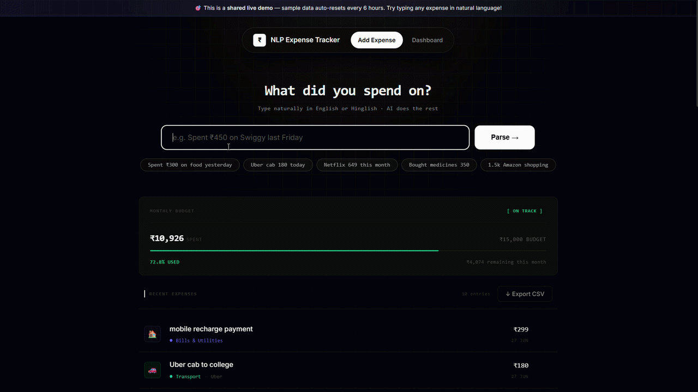
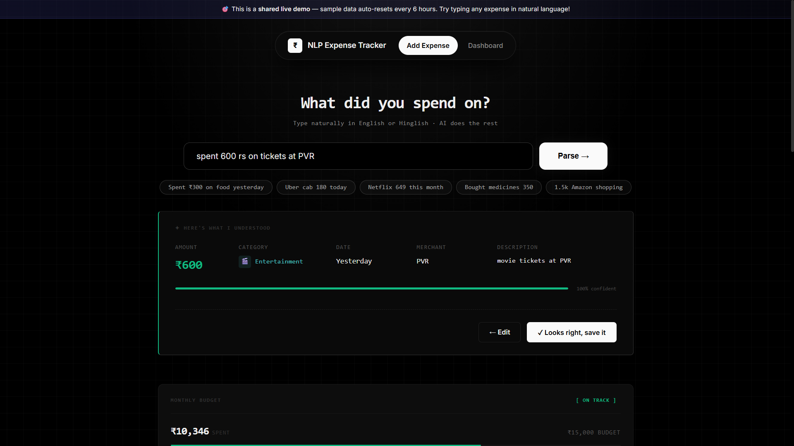
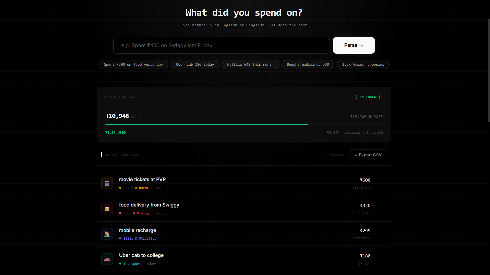
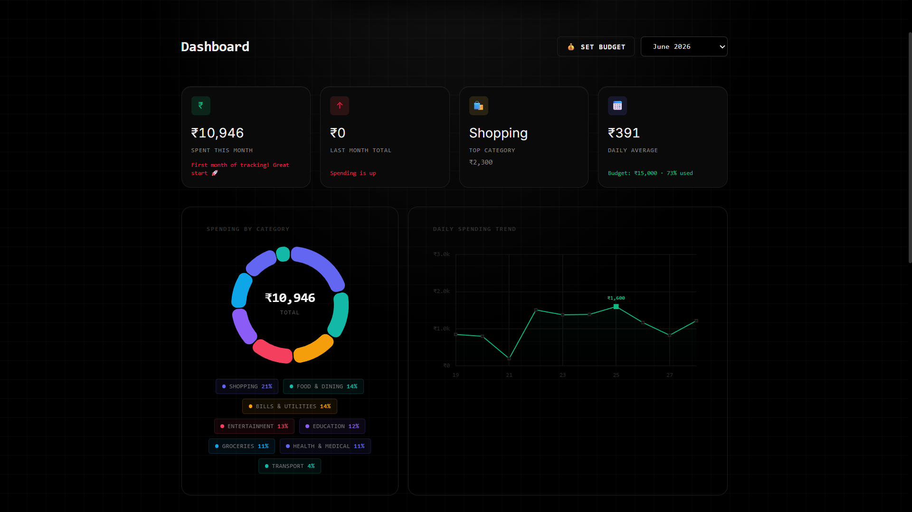
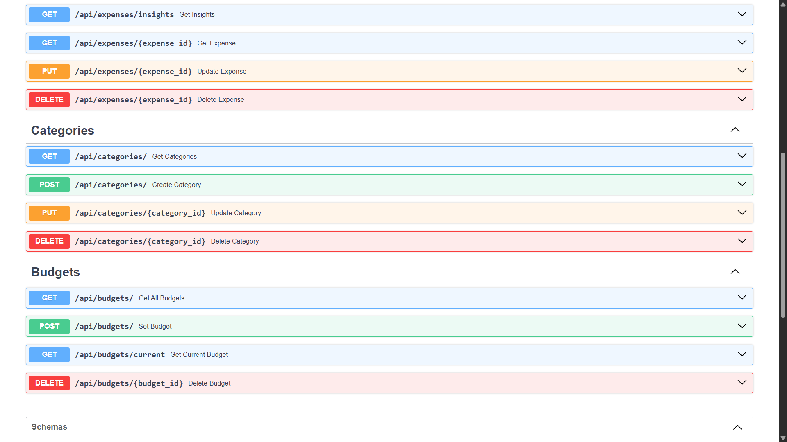

<div align="center">

<br/>


# NLP Expense Tracker

### Stop filling forms. Just tell it what you spent.

> *"Spent ₹450 on Swiggy last Friday"* → AI parses everything. You just confirm.

<br/>

[](https://fastapi.tiangolo.com/)
[](https://reactjs.org/)
[](https://python.org/)
[](https://aistudio.google.com/)
[](https://sqlite.org/)
[](https://vitejs.dev/)
[](https://chartjs.org/)
[](https://render.com/)
[](https://vercel.com/)

<br/>

**[🚀 Live Demo](https://nlp-expense-tracker-ebon.vercel.app)**
&nbsp;&nbsp;·&nbsp;&nbsp;
**[📡 API Docs](https://nlp-expense-tracker-api.onrender.com/docs)**
&nbsp;&nbsp;·&nbsp;&nbsp;
**[🐛 Report Bug](https://github.com/Princev834/nlp-expense-tracker/issues)**

<br/>


 🎯 **Shared live demo** — sample data auto-resets every 6 hours so anyone can try it freely.

<br/>

</div>

---

## 🤔 The Problem It Solves

Every expense tracker forces you into a form:

```
Amount: [        ]   Category: [ Dropdown ▾ ]   Date: [ 📅 ]   → Submit
```

That's not how you think about money. You think in sentences.

**This app lets you log expenses the way you actually speak:**

```
"Spent ₹450 on Swiggy last Friday"          →   ₹450 · Food & Dining    · June 20 · Swiggy
"Uber cab 200 this morning"                 →   ₹200 · Transport        · Today
"Netflix subscription 649"                  →   ₹649 · Entertainment    · Today   · Netflix
"Bought medicines from Apollo 350"          →   ₹350 · Health & Medical · Today   · Apollo
"2.5k Amazon shopping yesterday"            →  ₹2500 · Shopping         · June 27 · Amazon
```

One sentence. AI does the rest.

---

## ✨ Features

<table>
  <tr>
    <td width="50%">
      <h3>🤖 AI-Powered NLP Input</h3>
      <p>Type in plain English or Hinglish. Google Gemini extracts amount, category, date, and merchant automatically.</p>
    </td>
    <td width="50%">
      <h3>🔍 Smart Parse Preview</h3>
      <p>Before saving, see exactly what the AI understood — with a confidence percentage bar. Edit if needed.</p>
    </td>
  </tr>

  <tr>
    <td width="50%">
      <h3>📊 Analytics Dashboard</h3>
      <p>Doughnut chart for category split. Line chart for daily trend. Both update instantly when you switch months.</p>
    </td>
    <td width="50%">
      <h3>💡 Intelligent Insights</h3>
      <p>Month-over-month comparison, top spending category, daily average, and a human-readable trend message.</p>
    </td>
  </tr>

  <tr>
    <td width="50%">
      <h3>💰 Budget Tracker</h3>
      <p>Set monthly spending limits. Progress bar turns yellow at 80% and red when you go over.</p>
    </td>
    <td width="50%">
      <h3>🗓️ Month Selector</h3>
      <p>Browse analytics for any of the past 6 months from a single dropdown.</p>
    </td>
  </tr>

  <tr>
    <td width="50%">
      <h3>📤 CSV Export</h3>
      <p>Download all expenses as a spreadsheet. Opens correctly in Excel with ₹ symbol intact.</p>
    </td>
    <td width="50%">
      <h3>⚡ Auto API Docs</h3>
      <p>Full interactive Swagger UI at <code>/docs</code> — every endpoint is live-testable in the browser.</p>
    </td>
  </tr>
</table>

---

## 🏗️ Architecture

```
┌──────────────────────────────────────────────────────────────────────────┐
│                           BROWSER (React 18 + Vite)                      │
│                                                                          │
│   ┌──────────────────┐    ┌──────────────────────────────────────────┐   │
│   │   HomePage       │    │         DashboardPage                    │   │
│   │  ┌────────────┐  │    │  ┌──────────┐  ┌──────────────────────┐  │   │
│   │  │  NL Input  │  │    │  │ Doughnut │  │  Line Chart (daily)  │  │   │
│   │  │+ Preview   │  │    │  │  Chart   │  │  with gradient fill  │  │   │
│   │  └────────────┘  │    │  └──────────┘  └──────────────────────┘  │   │
│   │  ┌────────────┐  │    │  ┌────────────────────────────────────┐  │   │
│   │  │ExpenseList │  │    │  │  Insight Cards  │  Budget Bar      │  │   │
│   │  │+ BudgetBar │  │    │  │  Category Breakdown (sorted list)  │  │   │
│   │  └────────────┘  │    │  └────────────────────────────────────┘  │   │
│   └──────────────────┘    └──────────────────────────────────────────┘   │
│                   │  services/api.js (Axios)  │                          │
└───────────────────┼───────────────────────────┼──────────────────────────┘
                    │         HTTP / REST       │
┌───────────────────┼───────────────────────────┼──────────────────────────┐
│                   ▼   FastAPI (Python 3.12)   ▼                          │
│                                                                          │
│   ┌─────────────────┐  ┌──────────────────┐  ┌─────────────────────┐     │
│   │ /api/expenses   │  │  /api/categories │  │   /api/budgets      │     │
│   │ CRUD + NLP +    │  │  CRUD + budget   │  │   set / status /    │     │
│   │ analytics       │  │  per category    │  │   current month     │     │
│   └────────┬────────┘  └──────────────────┘  └─────────────────────┘     │
│            │                                                             │
│   ┌────────▼─────────────────────────────────────────────────────────┐   │
│   │                     nlp_parser.py                                │   │
│   │   text → build_prompt() → Google Gemini AI → JSON → validate     │   │
│   │   • Injects today's date + relative dates into prompt            │   │
│   │   • temperature=0.1 for deterministic output                     │   │
│   │   • find_closest_category() fallback for safety                  │   │
│   └────────┬─────────────────────────────────────────────────────────┘   │
│            │                                                             │
│   ┌────────▼───────────────────┐                                         │
│   │  SQLAlchemy ORM + SQLite   │   expenses · categories · budgets       │
│   └────────────────────────────┘                                         │
└──────────────────────────────────────────────────────────────────────────┘
```

---

## 🛠️ Tech Stack

### Backend
| Technology | Purpose |
|---|---|
| **Python 3.12** | Core language |
| **FastAPI** | REST API framework — async, auto-docs, Pydantic validation |
| **Uvicorn** | ASGI server |
| **SQLAlchemy ORM** | Database abstraction — zero raw SQL |
| **SQLite** | Database — zero config, single file |
| **Google Gemini AI** | NLP entity extraction via prompt engineering |
| **Pydantic v2** | Request/response validation with detailed error messages |
| **python-dotenv** | Environment variable management |

### Frontend
| Technology | Purpose |
|---|---|
| **React 18** | UI framework |
| **Vite** | Build tool and dev server |
| **React Router v6** | Client-side routing |
| **Chart.js + react-chartjs-2** | Doughnut and line charts |
| **Axios** | HTTP client with interceptors |
| **date-fns** | Date formatting utilities |

### DevOps
| Technology | Purpose |
|---|---|
| **Render** | Backend hosting (free tier) |
| **Vercel** | Frontend hosting with CDN |
| **GitHub** | Version control + CI/CD trigger |

---

## 📁 Project Structure

```
nlp-expense-tracker/
│
├── backend/                           ← Python · FastAPI · SQLAlchemy
│   ├── main.py                        ← Entry point — CORS, startup seeding, demo reset
│   ├── database.py                    ← SQLite engine + session factory + get_db()
│   ├── models.py                      ← ORM models: Expense, Category, Budget
│   ├── nlp_parser.py                  ← 🧠 Gemini AI integration + prompt engineering
│   ├── requirements.txt               ← Python dependencies
│   ├── .env                           ← Secret keys (not committed to Git)
│   ├── routers/
│   │   ├── expenses.py                ← 15 endpoints: CRUD, parse, analytics, insights
│   │   ├── categories.py              ← Category management with budget per category
│   │   └── budgets.py                 ← Monthly budget CRUD + current status
│   └── schemas/
│       └── expense_schema.py          ← Pydantic schemas for all request/response models
│
└── frontend/                          ← React 18 · Vite · Chart.js
    └── src/
        ├── components/
        │   ├── Navbar.jsx             ← Sticky nav with active link highlighting
        │   ├── ExpenseInput.jsx       ← NL input + parse preview + save flow
        │   ├── ExpenseCard.jsx        ← Single expense row with hover-delete
        │   ├── ExpenseList.jsx        ← Scrollable expense list with empty state
        │   ├── BudgetBar.jsx          ← Monthly progress bar (green → red)
        │   ├── BudgetModal.jsx        ← Modal dialog for setting budget limits
        │   ├── InsightCard.jsx        ← Stat card with icon, value, trend
        │   ├── CategoryChart.jsx      ← Doughnut with custom centre-text plugin
        │   ├── DailyChart.jsx         ← Line chart with dynamic gradient fill
        │   └── CategoryBreakdown.jsx  ← Sorted list with animated progress bars
        ├── pages/
        │   ├── HomePage.jsx           ← Input + budget bar + expense list
        │   └── DashboardPage.jsx      ← Full analytics dashboard
        ├── services/
        │   └── api.js                 ← All Axios calls — single source of truth
        └── utils/
            ├── categoryConfig.js      ← Category → colour + icon mapping
            ├── chartSetup.js          ← Chart.js global registration + dark theme
            └── exportCSV.js           ← CSV builder with UTF-8 BOM for Excel
```

---

## 🚀 Quick Start (Run Locally)

### Prerequisites
- Python 3.12+
- Node.js 20+
- Free Gemini API key → [aistudio.google.com/app/apikey](https://aistudio.google.com/app/apikey)

### 1. Clone the repository
```bash
git clone https://github.com/Princev834/nlp-expense-tracker.git
cd nlp-expense-tracker
```

### 2. Start the backend
```bash
cd backend

# Create and activate virtual environment
python -m venv venv
venv\Scripts\activate          # Windows
# source venv/bin/activate     # Mac / Linux

# Install dependencies
pip install -r requirements.txt

# Create your .env file
echo GEMINI_API_KEY=your_api_key_here > .env

# Start the server
uvicorn main:app --reload
```

✅ Backend running at: `http://localhost:8000`
✅ API Docs at: `http://localhost:8000/docs`

### 3. Start the frontend
```bash
# Open a second terminal
cd frontend
npm install
npm run dev
```

✅ App running at: `http://localhost:5173`

---

## 📡 API Reference

| Method | Endpoint | Description |
|--------|----------|-------------|
| `POST` | `/api/expenses/parse` | Parse NL text → preview only, does **not** save |
| `POST` | `/api/expenses/parse-and-save` | Parse + save in one request |
| `POST` | `/api/expenses/` | Save a manually built expense |
| `GET`  | `/api/expenses/` | All expenses (filter: `?month=YYYY-MM&category=`) |
| `GET`  | `/api/expenses/{id}` | Single expense by ID |
| `PUT`  | `/api/expenses/{id}` | Edit an expense |
| `DELETE` | `/api/expenses/{id}` | Delete an expense |
| `GET`  | `/api/expenses/summary/monthly` | Category totals + percentages for charts |
| `GET`  | `/api/expenses/summary/daily` | Day-by-day spending for line chart |
| `GET`  | `/api/expenses/insights` | Trend, top category, daily average |
| `GET`  | `/api/categories/` | All categories with colour + icon |
| `POST` | `/api/categories/` | Create custom category |
| `PUT`  | `/api/categories/{id}` | Edit category |
| `DELETE` | `/api/categories/{id}` | Delete (blocked if expenses use it) |
| `POST` | `/api/budgets/` | Set or update monthly budget |
| `GET`  | `/api/budgets/current` | This month: budget vs actual spend + status |
| `GET`  | `/api/demo/reset?secret=` | Reset demo data (protected by secret key) |

> Full interactive documentation with live-testable endpoints at [`/docs`](https://nlp-expense-tracker-api.onrender.com/docs)

---

## 🧠 How the NLP Engine Works

The core intelligence lives in `backend/nlp_parser.py`.

### The Parsing Flow

```
User input: "Paid ₹1,500 to Amazon last Saturday"
                        │
                        ▼
            build_prompt(text, categories)
            ┌─────────────────────────────────┐
            │  Today = Sunday, June 29 2025   │  ← injected at runtime
            │  "last Saturday" = June 21      │  ← pre-computed in Python
            │  Categories: [Food, Transport…] │  ← pulled from database
            └─────────────────────────────────┘
                        │
                        ▼
              Google Gemini AI (temperature=0.1)
                        │
                        ▼
            Raw JSON response:
            {
              "amount": 1500.0,
              "category": "Shopping",
              "date": "2025-06-21",
              "description": "Amazon online shopping",
              "merchant": "Amazon",
              "confidence": 0.97
            }
                        │
                        ▼
            Validation + type enforcement
            + find_closest_category() fallback
                        │
                        ▼
            Saved to SQLite database ✅
```

### Key Engineering Decisions

**Why `temperature=0.1`?**
Low temperature makes the model deterministic — it returns consistent, predictable JSON instead of creative varied responses. Critical for a data extraction pipeline where you need the same input to always produce the same structure.

**Why pre-compute dates in Python?**
If you ask an AI "what was last Friday's date?", it can guess wrong depending on its training context. By injecting the exact computed date into the prompt (`"last Friday" = 2025-06-20`), the model never has to guess — it just maps the label to the date you provide.

**Why embed the category list in the prompt?**
Without a fixed list, Gemini might return "Food" when your category is "Food & Dining". By giving it the exact list and saying "pick ONLY from this", you get consistent category names that match your database every time.

**The `find_closest_category()` fallback**
Even with clear instructions, the model occasionally returns a slightly different name. This function runs keyword matching as a safety net before defaulting to "Other" — This reduces the chance of incorrect categories and safely defaults to "Other" when no close match is found.

### Supported Input Formats

```
Currency symbols:    ₹300  Rs 300  rs300  $10
Shorthand amounts:   1k → 1000   2.5k → 2500   1L → 100000
Relative dates:      today, yesterday, last Friday, 2 days ago, a week ago
Merchants:           Swiggy, Amazon, Uber, Netflix, Apollo, DMart, Udemy…
Languages:           English, Hinglish (mixed Hindi-English)
```

### Model Note

> This project uses **Google Gemini Flash Lite** for NLP parsing. The specific model version (`gemini-1.5-flash-lite`, `gemini-2.0-flash-lite`, etc.) can be changed in `nlp_parser.py` when API quota limits are reached on a given model tier. The `GEMINI_API_KEY` environment variable is used only for authentication. The parsing logic and prompt structure are model-agnostic.

---

## 🌐 Deployment

| Service | Platform | URL |
|---------|----------|-----|
| Frontend | Vercel (free) | [nlp-expense-tracker-ebon.vercel.app](https://nlp-expense-tracker-ebon.vercel.app) |
| Backend API | Render (free) | [nlp-expense-tracker-api.onrender.com](https://nlp-expense-tracker-api.onrender.com) |
| API Docs | Render (free) | [nlp-expense-tracker-api.onrender.com/docs](https://nlp-expense-tracker-api.onrender.com/docs) |

### Environment Variables

**Backend (Render)**
| Variable | Description |
|---|---|
| `GEMINI_API_KEY` | Your Google Gemini API key |
| `DEMO_SECRET` | Secret key to protect the manual demo-reset endpoint |

**Frontend (Vercel)**
| Variable | Description |
|---|---|
| `VITE_API_URL` | Full backend URL e.g. `https://your-api.onrender.com/api` |

### Demo Data System
Since this is a shared demo with no authentication, the app includes an auto-reset system:
- On every server startup, 18 realistic sample expenses are seeded
- A background thread resets and re-seeds data every **6 hours** automatically
- A manual reset endpoint exists at `/api/demo/reset?secret=` for instant resets
- A banner in the UI informs visitors that data is shared and auto-resets

---

## 🖼️ Screenshots & Demo

### 🎥 Demo Preview



<br/>

### 📸 Screenshots

| Home — NL Input                                               | Parse Preview                                                              |
| ------------------------------------------------------------- | -------------------------------------------------------------------------- |
|  |  |

| Analytics Dashboard                                                          | API Documentation                                                         |
| ---------------------------------------------------------------------------- | ------------------------------------------------------------------------- |
|  |  |

---


---

## 🗺️ Roadmap

- [x] Natural language expense parsing with Gemini AI
- [x] Analytics dashboard with Chart.js
- [x] Monthly budget tracking
- [x] CSV export
- [x] Auto-reset demo system
- [x] Deployed on Render + Vercel
- [ ] JWT authentication — each user sees only their own data
- [ ] PDF monthly report export
- [ ] Voice input using Web Speech API
- [ ] Recurring expense detection
- [ ] Anomaly alerts ("You spent 3× more on food this week")
- [ ] WhatsApp bot integration

---

## 🤝 Contributing

Contributions are welcome. If you find a bug or have an idea:

1. Fork the repository
2. Create a feature branch: `git checkout -b feature/your-feature`
3. Commit your changes: `git commit -m "Add your feature"`
4. Push and open a Pull Request

---

## 👨‍💻 Author

**Prince Vekariya**
MCA Student · Dharmsinh Desai University

[](https://linkedin.com/in/prince-vekariya)
[](https://github.com/Princev834)

---

## 📄 License

This project is licensed under the **MIT License** — see the [LICENSE](LICENSE) file for details.

---

<div align="center">

If this project helped you or you found it interesting, please consider giving it a ⭐

*Built with Python, React, and AI assistance.*

</div>